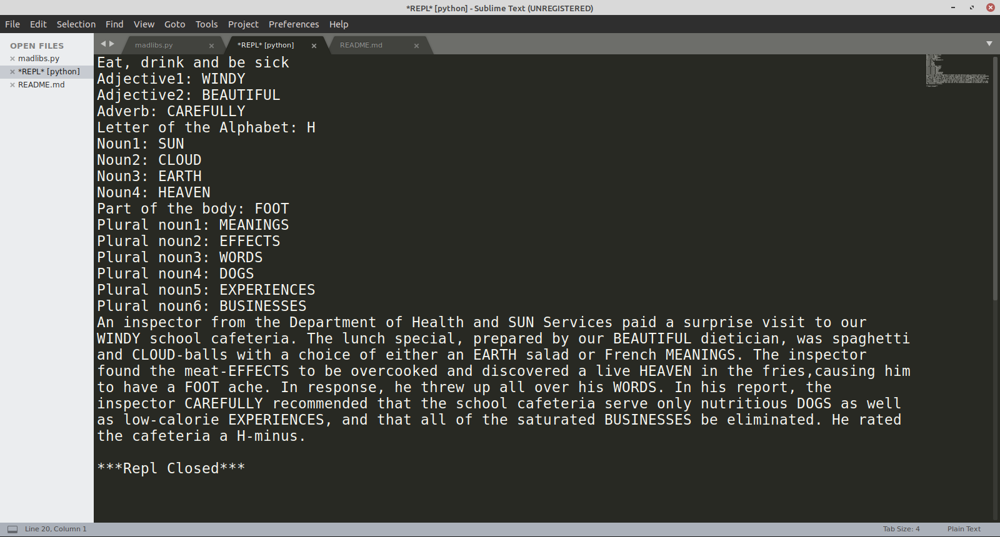

## Madlibs

Madlibs word substitution game for console / command prompt

* Gives Recomendations for password storage software

## Built With

* [Python](https://www.python.org/) - Backend framework used

## Author

* _Žarko Juzvišen_ - Initial work - [Github](https://github.com/Juzvisen)

## Acknowledgments

* Kylie Ying - Coding Course - [Youtube](https://www.youtube.com/watch?v=8ext9G7xspg)
* [Redkid.net](http://www.redkid.net/cgi-bin/madlibs/eatdrinkandbesick.pl)